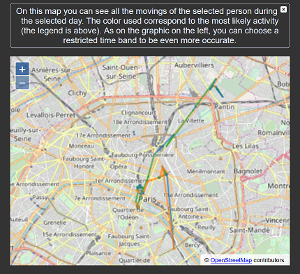

# WhereWasI - Comment me suis-je déplacé ?

**Projet réalisé par Théo PONTON, Julien GRENIER et Martin CHAUVIN dans le cadre du MOS 5.5 de l'Ecole Centrale Lyon**

## Présentation du sujet

*La question à laquelle nous voulons répondre*

<p style="text-align:justify">Nous voulons savoir quels déplacements ont été effectués par une personne : dans quelles villes et pays cette personne a été, comment se sont répartis ses déplacements durant la journée, quels moyens de transports cette personne a utilisé. </p>

*De quelles données avons nous besoin ?*

<p style="text-align:justify">Nous avons besoin de positions GPS d'une personne avec une fréquence de plusieurs fois par jour. Soit au minimum un triplet de type : latitude, longitude, temps du relevé de position.
Pour chacune de ces positions, nous avons également besoin d'une estimation du mode de déplacement : statique, marche, course, vélo, voiture, ...</p>

## Présentation du jeu de données

<p style="text-align:justify">Le jeu de données utilisé sera celui fourni par les localisations de Google. Sur un compte Google, il est possible d'activer les localisations et de télécharger ses données. Voici le lien pour accéder à la page de téléchargement : <a href="https://support.google.com/accounts/answer/3024190?hl=fr">ici</a></p>

<p style="text-align:justify">Le jeu de données est un Json qui contient des relevés toutes les 2 minutes environ. On y trouve des informations comme : la longitude, la latitude, l'altitude, la vitesse, l'heure, et une liste d'activités avec la confiance pour chacune.</p>

```json
"timestampMs" : "1540744774000",
"latitudeE7" : 492884809,
"longitudeE7" : -3045980,
"accuracy" : 6,
"velocity" : 0,
"altitude" : 55,
"verticalAccuracy" : 8,
"activity" : [ {
    "timestampMs" : "1540744775803",
    "activity" : [ {
        "type" : "STILL",
        "confidence" : 71
    }, {
        "type" : "ON_FOOT",
        "confidence" : 20
    }, {
        "type" : "WALKING",
        "confidence" : 20
    }, {
        "type" : "IN_VEHICLE",
        "confidence" : 3
    }, {
        "type" : "IN_RAIL_VEHICLE",
        "confidence" : 3
    }, {
        "type" : "ON_BICYCLE",
        "confidence" : 2
    }, {
        "type" : "UNKNOWN",
        "confidence" : 2
    }, {
        "type" : "IN_ROAD_VEHICLE",
        "confidence" : 2
    }, {
        "type" : "IN_TWO_WHEELER_VEHICLE",
        "confidence" : 1
    }, {
        "type" : "IN_FOUR_WHEELER_VEHICLE",
        "confidence" : 1
    } ]
} ]
```

Nous avons ensuite traité ces données à l'aide des scripts Python présents dans ce répertoire :

- pris 1 points sur 12
- fusion d'activités similaires
- ...

## Conception de la visualisation

<p style="text-align : justify">Afin de répondre à la question que nous nous sommes posé. Nous avons choisi de faire 4 visualisations :
 <ul>
  <li>Une carte pour visualiser les déplacements</li>
  <li>Une représentation en fonction du temps de la probabilité des activités pour voir quelle activité a été faîte a quel moment</li>
  <li>Une représentation de la distance en fonction des activités</li>
  <li>Une représentation de la distance en fonction des heures de la journée</li>
</ul>
</p>

<p style="text-align : justify">Avant de nous lancer dans le développement, nous avons réalisé quelques design sheets. Ils sont tous disponibles sur la page d'accueil de notre site. Nous vous montrons ici la feuille finale correspondant à l'idée que nous nous sommes fait de notre site avant de commencer le développement :</p>


Nous avons donc ensuite développé notre solution disponible <a href="https://neyri.github.io/Projet-Data-viz/">ici</a>.

## Principales fonctionnalités

Le site comporte une page d'accueil qui est la suivante :


<p style = "text-align : justify">Cette page comporte les liens vers les comptes LinkedIn et GitHub de chacun des membres du projet. On voit également que cette page comporte plusieurs liens :</p>

- Le premier lien renvoie vers le projet de visualisation
- Tous les autres liens renvoient vers les design sheet manuscrits réalisés en début de projet

<p style = "text-align : justify">Le dernier lien renvoie vers le design sheet qui décrit le site tel que nous l'avions imaginé au début du projet (visualisation disponible dans la partie "Conception")</p>

En ce rendant sur le projet de visualisation on arrive sur la page suivante :


Sur cette page, les données sont déjà chargées. On peut distinguer 5 parties :

#### Cadre des paramètres de visualisation

<p style = "text-align : justify">La partie supérieure permet de choisir la date pour laquelle on souhaite visualiser les données, mais aussi la tranche horaire que l'on souhaite. On indique aussi la légende concernant les modes de transport estimés par google. Il y a aussi un choix à coché qui permet d'interagir avec la visualisation en haut à gauche. Son rôle sera expliqué ensuite.
Voici une meilleure visualisation de ce cadre :</p>


#### Line-chart des probabilités de mode de déplacement

<p style = "text-align : justify"> La première visualisation en haut à gauche est un line-chart qui représente la probabilité associée à chaque mode de transport (à pied, immobile, en voiture...). On rappelle que ces probabilités sont estimés par Google.
Cette visualisation est double. Elle permet d'une part de voir sur une certaine échelle de temps la probabilité associée à chaque déplacement en cochant la case "Probabilistic activity" dans le cadre des paramètres (voir ci-dessous).</p>


<p style = "text-align : justify">D'autre part, il est également possible de visualisé sous forme de bar-chart le mode de déplacement le plus probable pour plus de clarté en cochant la case "Most likely activity" (voir ci-dessous)</p>


#### Carte des déplacements

Cette visualisation disponible en haut à droite de l'écran permet de voir sur une carte les différentes positions pour l'échelle de temps sélectionnée (inférieure une journée).



Le zoom de la carte s'ajuste automatiquement pour visualiser l'ensemble des positions et déplacements réalisés sur la période de temps sélectionnée. Les trajets sont également colorés avec la couleur correspondant au mode de transport le plus probable.


#### Bar-chart de la distance réalisée pour chaque mode de transport

Ce bar-chart permet de visualiser pour la journée sélectionnée la distance réalisée pour chaque mode de transport. Pour le calcul, chaque distance est attribuée au mode de transport le plus probable et la somme est faite sur la journée. Attention, cette visualisation n'est pas modifiée par la restriction temporelle que l'on  peut choisir via le cadre des paramètres.


#### Bar-chart de la distance réalisée par heure de la journée

Ce bar-chart permet de visualiser pour la journée sélectionnée la distance réalisée, quelque soit le mode de transport.


## Visualisez VOS données

Vous pouvez visualiser votre propre historique des positions Google.

Pour cela, téléchargez vos données [ici](https://takeout.google.com/). Vous pouvez sélectionner toutes les données Google que vous souhaitez, mais il vous faut au moins sélectionner la catégorie *Historique des positions*.

Vous allez ensuite recevoir un lien de téléchargement sur votre adresse gmail pour télécharger le fichier zip contenant toutes vos données. Le télécharger et le dézipper.

Le fichier contenant vos positions est `Takeout/Historique des positions/Historique des positions.json`


Téléchargez ce répertoire.

Déplacez votre fichier `Historique des positions.json` dans le dossier `data` (n'ayez pas peur de remplacer notre fichier).

Exécutez ensuite le script python `filter.py` contenu dans le dossier `scripts`. Celui-ci va créer un fichier `data.json` au bon format.


Lancez un serveur local avec votre outil préféré. Le mien étant d'exécuter la commande suivante `python -m http.server`.

Votre visualisation est finalement disponible [ici](http://localhost:8000/visualisations/data_analysis.html).